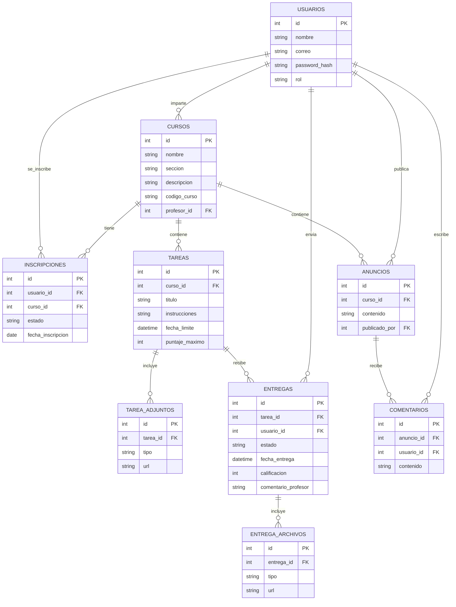

```mermaid
erDiagram
  USUARIOS ||--o{ CURSOS : imparte
  USUARIOS ||--o{ INSCRIPCIONES : se_inscribe
  CURSOS ||--o{ INSCRIPCIONES : tiene
  CURSOS ||--o{ TAREAS : contiene
  CURSOS ||--o{ ANUNCIOS : contiene
  TAREAS ||--o{ TAREA_ADJUNTOS : incluye
  TAREAS ||--o{ ENTREGAS : recibe
  USUARIOS ||--o{ ENTREGAS : envia
  ENTREGAS ||--o{ ENTREGA_ARCHIVOS : incluye
  USUARIOS ||--o{ ANUNCIOS : publica
  ANUNCIOS ||--o{ COMENTARIOS : recibe
  USUARIOS ||--o{ COMENTARIOS : escribe

  USUARIOS {
    int id PK
    string nombre
    string correo
    string password_hash
    string rol
  }
  CURSOS {
    int id PK
    string nombre
    string seccion
    string descripcion
    string codigo_curso
    int profesor_id FK
  }
  INSCRIPCIONES {
    int id PK
    int usuario_id FK
    int curso_id FK
    string estado
    date fecha_inscripcion
  }
  ANUNCIOS {
    int id PK
    int curso_id FK
    string contenido
    int publicado_por FK
  }
  COMENTARIOS {
    int id PK
    int anuncio_id FK
    int usuario_id FK
    string contenido
  }
  TAREAS {
    int id PK
    int curso_id FK
    string titulo
    string instrucciones
    datetime fecha_limite
    int puntaje_maximo
  }
  TAREA_ADJUNTOS {
    int id PK
    int tarea_id FK
    string tipo
    string url
  }
  ENTREGAS {
    int id PK
    int tarea_id FK
    int usuario_id FK
    string estado
    datetime fecha_entrega
    int calificacion
    string comentario_profesor
  }
  ENTREGA_ARCHIVOS {
    int id PK
    int entrega_id FK
    string tipo
    string url
  }
```